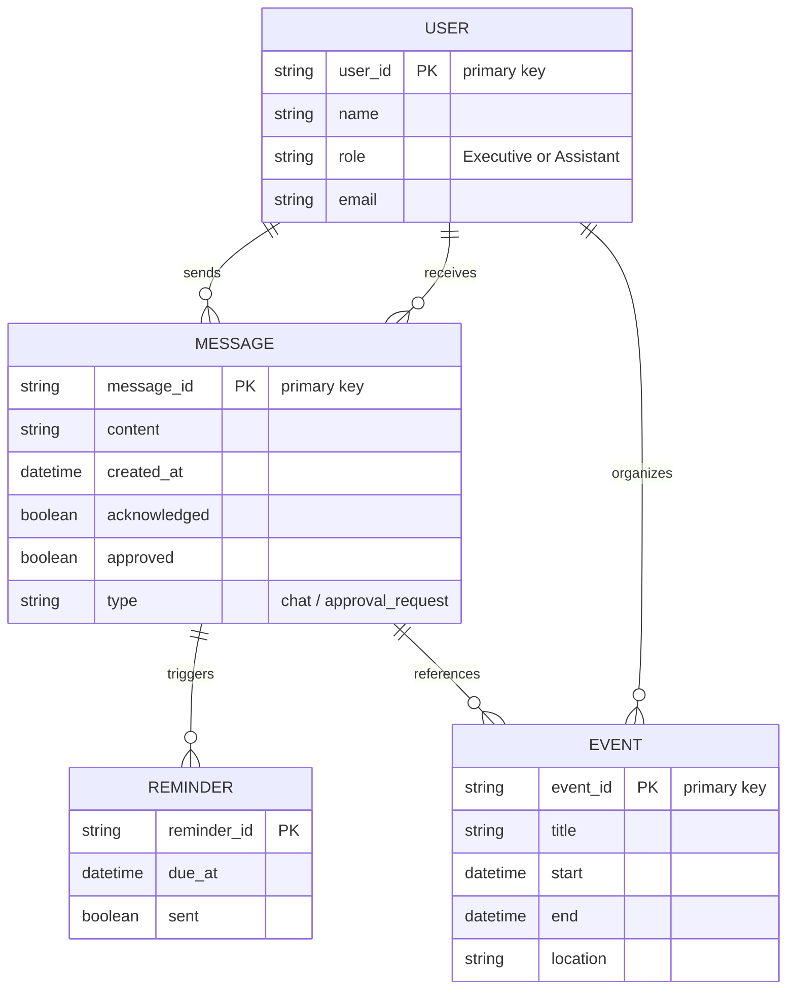

# Executive Summary  
The **ExecutiveLink** app is a mobile-first coordination platform for a CEO/Managing Director and their assistant (“Prime Assistant”).  It combines chat, task approval, calendar sync, reminders, and reporting into a single secured workspace.  We will build it on the Antigravity PaaS (an agentic dev platform by Google) using its SDK/CLI and integrations.  The Phase 1 MVP supports two-way messaging, acknowledgement/approval workflows, calendar event sync, and automated reminders/follow-ups.  The backend services (auth, real-time messaging, notifications, audit logging, admin console) will be containerized on Antigravity (or generic cloud) with standard security (OAuth2/OIDC, TLS, encryption) and compliance with GDPR/PDPA.  A robust CI/CD pipeline with autoscaling and monitoring will be set up.  The delivery includes detailed API contracts, data models (ER diagram), component diagrams, and a mermaid timeline.  Primary sources include Antigravity docs, OAuth2 standards, mobile HIG/UX guidelines, and privacy regulations.  The final deliverable will be prepared in Markdown and exported to Word.  

## Product Overview  
ExecutiveLink is a **task- and communication-management app for executives and assistants**.  It’s designed for CEOs, managing directors, and their designated assistants to ensure nothing critical gets missed.  Key use-cases include: sending urgent messages, routing requests for approval, acknowledging instructions, tracking follow-ups, and coordinating last-minute schedule changes.  The app features **chat + task workflows → approvals/acks → calendar updates → briefing reports → audit trail** (per the Phase 1 plan).  For example, an assistant can send an urgent meeting request to the CEO; the CEO can acknowledge or act on it; and the system auto-generates calendar updates, reminders, and a daily briefing summary.  This closes the loop on executive-assistant communication and prevents “slip-through” in critical tasks.  

## Target Users & Market Positioning  
The initial target users are **executives (CEOs, MDs, VPs) and their executive assistants** at mid-size companies and enterprises.  These users have high volumes of meetings, rapidly changing schedules, and many pending approvals.  ExecutiveLink’s **value proposition** is not to replace generic messaging or email, but to provide a **controlled, accountable exec-assistant workspace**.  We will position it as a specialized executive coordination tool rather than a consumer chat app.  (Large enterprises may adopt it if integrated with their IT systems.)  

## Prioritized Phase 1 Features  
Phase 1 (MVP) focuses on core exec–assistant workflows:  
- **Secure 1:1 Chat & Task Messages:** Text-based two-way messaging between CEO and assistant, with support for attaching tasks (e.g. “Book flight”).  
- **Acknowledgement & Approval Tracking:** Messages/tasks require explicit Exec acknowledgement or approval.  The assistant sees status (pending/acknowledged/approved).  
- **Shared Calendar Sync:** Bi-directional sync with executive’s calendar (Google/Outlook).  Events created in the app appear in Exec calendar, and vice versa.  Meeting changes auto-notify the assistant.  
- **Automated Reminders & Follow-ups:** Unacknowledged or overdue items trigger reminder notifications to the relevant party.  Follow-up tasks can be generated automatically if not resolved.  
- **Daily Briefing Report:** Each morning, ExecutiveLink compiles a summary of pending tasks, recent approvals, and the day’s schedule for the executive.  
- **Audit Trail:** All communications, actions, and changes are logged with timestamps and user IDs for auditing.  

These features implement the “message → ack → decision → calendar update → brief → log” workflow loop envisioned in the plan.  

## User Flows  
1. **Message + Acknowledge**: The assistant sends a task message (e.g. “Approve contract”); the CEO receives it in-app or via push, reads it, and taps **Acknowledge** or **Decline/Approve**. The assistant’s view updates to show the status.  
2. **Approval Workflow**: The assistant submits a request for approval (expense, leave, etc.). The CEO sees an action button (Approve/Reject) and can respond. Assistant is notified of the decision.  
3. **Calendar Update**: The assistant adds a meeting or changes a time. ExecutiveLink syncs with the executive’s calendar and sends a push alert to the CEO. If the CEO adjusts the time, both the assistant and the app update.  
4. **Reminder Generation**: If a message/task is not acknowledged within a set SLA, ExecutiveLink sends an automated reminder to the CEO (and cc’s the assistant) until resolved.  
5. **Daily Briefing**: At a scheduled time (e.g. 7 AM), the app compiles all outstanding tasks and the day’s events into a briefing. The CEO can review or dismiss each item.  

Below is a simplified **Entity-Relationship diagram** of the core data model. Users (executive or assistant) exchange Messages and organize Calendar Events.  Each Message may link to an Event (e.g. scheduling a meeting).  



## Component Architecture  

```mermaid
graph TB
  subgraph Mobile [Clients]
    A[Mobile App (iOS/Android)]
    B[Admin Console (Web)]
  end
  subgraph Cloud [Backend Services (Antigravity PaaS)]
    Auth[(Auth & Identity Service)]
    API[REST/WebSocket API Gateway]
    Chat[Real-Time Messaging Service]
    Cal[Calendar Sync Service]
    Push[Notification Service]
    Log[Audit/Logging Service]
    DB[(Database)]
  end
  A -->|HTTPS/Socket| API
  B -->|HTTPS| API
  API --> Auth
  API --> Chat
  API --> Cal
  API --> Push
  API --> Log
  API --> DB
```

- **Mobile Client (iOS/Android):** Native apps (Swift/Kotlin or cross-platform) implementing UI for chat, calendar, approvals. Follows Apple and Android HIG for navigation, notifications, accessibility, etc. 
- **Backend Services:** Hosted on Antigravity (Google Cloud) or similar PaaS. Exposes REST and WebSocket endpoints (see API Contracts below).  
- **Real-Time Messaging:** A WebSocket-based service (e.g. using Socket.IO or cloud pub/sub) to push chat and task updates instantly.  
- **Notification Service:** Integrates with APNs (iOS) and FCM (Android) for push notifications, and optionally SMS/Email for critical alerts.  
- **Calendar Sync:** Integrates with Google Calendar API and Microsoft Graph (Outlook) to sync events.  
- **Auth & Identity:** OAuth 2.0 / OpenID Connect (e.g. via Google Identity, Okta or Cognito) to authenticate users. Role-based access (executive vs assistant). Tokens (JWT) secured by TLS.  
- **Database:** A cloud-hosted SQL/NoSQL DB (e.g. Cloud SQL or Firestore). Stores users, messages, events, reminders, logs.  
- **Audit/Logging:** Every action (message sent, approval made, login, etc.) is logged. Logs and analytics may go to a logging service (e.g. Cloud Logging) for monitoring and compliance.  
- **Admin Console:** Web app for system administrators to manage accounts, view logs, set policies.

All traffic is over TLS, and data at rest is encrypted (per Antigravity/GCP standards). The entire stack runs on Google Cloud with VPC isolation, complying with enterprise governance and regional data residency requirements.

## API Contracts  

### REST Endpoints  
- **POST /api/v1/auth/login**: Obtain OAuth2 token (via SSO SAML/OIDC). *Request:* `{ "provider":"google", "code":"..." }` *Response:* `{ "access_token":"...", "refresh_token":"...", "expires_in":3600 }`.  
- **GET /api/v1/user/{id}/messages**: Fetch chat/messages for user. *Response:* `{ "messages": [ {id, from_user, to_user, content, status, timestamp}, ... ] }`.  
- **POST /api/v1/user/{id}/messages**: Send a new message/task. *Request:* `{ "to_user":"uuid", "content":"...", "requires_ack": true }`. *Response:* `{ "message_id":"uuid", "timestamp": "..."}.`  
- **POST /api/v1/messages/{id}/ack**: Mark a message as acknowledged or approved. *Request:* `{ "action":"ack"|"approve"|"reject" }`. *Response:* `{ "status":"ok", "new_status":"acknowledged" }`.  
- **GET /api/v1/user/{id}/events**: Get calendar events (merged with external calendars).  
- **POST /api/v1/user/{id}/events**: Create a new event (syncs to external calendar).  
- **WebSocket /ws/updates**: Real-time channel. After auth, the server pushes events: `{type:"message", data:{...}}`, `{type:"reminder", data:{...}}`, etc.  

(Schemas follow JSON conventions; requests and responses include standard metadata like timestamps and UUIDs.)

### Security (AuthN/AuthZ)  
- **OAuth2 Authorization:** We will use Authorization Code flow with PKCE for mobile clients.  Tokens issued to the app have scopes (e.g. `chat:send`, `calendar:edit`).  
- **OpenID Connect:** If using Google SSO or enterprise SSO, we accept OIDC ID tokens to identify the user’s email and role.  
- **Role-Based Access:** The backend checks that only an assistant can send requests to their assigned executive, etc. The API enforces that a user can only view their own messages/events.  
- **Encryption:** All API calls use HTTPS/TLS. Data at rest (databases, logs) are encrypted by the cloud provider.  

## Data Model and Entities  

The data model includes (see ER diagram above):  

- **User:** Execs and assistants. Each user has a UUID, name, role, and linked calendar credentials.  
- **Message:** Represents a chat or task. Fields: sender, recipient, content, timestamp, flags for acknowledgment/approval.  
- **Event:** Calendar entries, with title, time, etc. Linked to messages if created via a chat.  
- **Reminder:** Tracks automated reminders for overdue tasks (with due time and sent flag).  
- **Audit Log:** (Not shown above) separate datastore of all actions (for GDPR audit requirements).  

Foreign keys enforce that messages refer to valid users/events. 

## Component and Deployment (Scalability)  

We will deploy services as **containers** (e.g. Docker) in Antigravity Cloud (analogous to Google Cloud Run or Kubernetes).  Antigravity SDK or CLI will manage deployments.  Key aspects:  

- **Autoscaling:** Use horizontal autoscaling on the backend (based on CPU or queue depth) for the API and messaging services.  
- **Datastores:** Use managed database clusters (Cloud SQL or Firestore) with read replicas for scale.  
- **CI/CD:** GitHub Actions or Cloud Build pipelines triggered on merge, using Antigravity CLI. Builds produce containers, run tests, and deploy to staging/production.  
- **Monitoring:** Cloud Monitoring and Logging for health checks, uptime, performance. Alerts on errors or high latency.  
- **Antigravity Specifics:** The Antigravity SDK provides local agent models for development, but production APIs will run on Google Cloud (per Antigravity Enterprise docs). If Antigravity has a proprietary hosting model, we’ll use its container registry and runtime. Otherwise, use Google Kubernetes Engine or Cloud Run with the Antigravity CLI for deployment.  

*Antigravity Note:* Antigravity is primarily a development **platform** (IDE, CLI, agent-runner). It integrates with Google Cloud (Gemini Enterprise) for hosting. Where Antigravity-specific SDKs or deployment tools are unavailable, we follow generic PaaS patterns (containerize microservices, use standard OAuth/OIDC, etc.).  

## Security & Compliance  

- **Authentication:** OAuth 2.0/OIDC ensures secure login (e.g. Google Workspace accounts or corporate SAML). Short-lived access tokens; refresh tokens rotate with PKCE.  
- **Authorization:** Role checks (“Executive” vs “Assistant”) in every API. Least privilege: an assistant cannot access other execs’ data. Admin Console is restricted to super-admin users only.  
- **Encryption:** TLS 1.2+ for all network traffic. Data encrypted at rest (AES-256). Passwords/secrets (if any) stored in a Secrets Manager.  
- **Data Residency & GDPR/PDPA:** By deploying in the customer’s cloud region (Antigravity/GCP), we comply with data residency laws (Antigravity enterprise avoids data leaving VPC). We will support user data deletion on request and collect minimal PII (just name/email). All personal data is processed only for app purposes.  
- **Privacy:** System logs contain no sensitive content. The daily briefing summary may include task descriptions, so it will be secured and transmitted only over the app.  
- **Penetration Testing:** Backend will undergo security testing (OWASP standards). We adopt secure coding practices from OWASP and Google Cloud’s architecture guidelines.  

## Testing Strategy  

- **Unit Tests:** For all services (API endpoints, business logic, data model).  
- **Integration Tests:** Test flows like messaging, approvals, and calendar sync end-to-end. Mock external APIs (calendar, notifications).  
- **User Acceptance / Beta:** A pilot with one executive/assistant pair to validate usability.  
- **Load Testing:** Simulate realistic usage (e.g. an executive receives dozens of tasks per day) to verify scaling.  
- **Security Audits:** Pen-testing and code reviews focusing on auth and data access.  

## Rollout / Pilot Plan  

We recommend a **phased rollout**:  

1. **Internal Pilot (4 weeks):** Deploy to a small team (1 CEO + 1 assistant). Collect feedback, adjust UI/flows.  
2. **Beta Rollout (2 months):** Onboard several executives across one or two departments. Monitor performance and gather usage metrics.  
3. **Full Launch:** Open to all consenting departments/organizations, with documentation and training.  

During the pilot, we will track metrics such as message throughput, approval response times, and app stability. 

## Phase 2 Migration Path  

Phase 2 will extend functionality (multi-assistant support, approval chains, more integrations).  The architecture is designed for this growth: additional microservices or database tables can be added without disruption. The CI/CD pipeline already supports multiple environments. Data migration (e.g. expanding tables) will be done via zero-downtime schema changes. We will ensure backward compatibility of APIs so mobile clients don’t break during upgrades.  

## Alternatives Comparison  

| Component      | Option A (Chosen)                         | Option B (Alternative)                                   | Pros/Cons                                  |
|----------------|-------------------------------------------|----------------------------------------------------------|--------------------------------------------|
| **PaaS Host**  | Google Cloud / Antigravity (proposed)     | AWS (Elastic Beanstalk/EKS) or Azure                     | GCP tight integration with Antigravity (enterprise security). AWS/Azure offer similar PaaS. |
| **AuthN/AuthZ**| Google Identity Platform (OAuth2/OIDC)    | Auth0 / Okta / AWS Cognito                               | Google SSO simplifies for orgs; alternatives provide more vendor choice. Google ensures compatibility. |
| **Real-time**  | WebSockets on Node.js server or Google Pub/Sub | Firebase Realtime DB or Socket.IO                        | Self-managed WS gives control; Firebase simplifies but locks to Google. |
| **Notifications**| Firebase Cloud Messaging & APNs         | Third-party (e.g. Twilio SMS, Urban Airship)            | FCM/APNs free for push; Twilio/SMS adds cost but reach (SMS). |
| **Calendar Sync**| Google Calendar API + MS Graph          | iCal/Exchange connectors                                 | Direct APIs cover most users; iCal import is fallback for others. |
| **Database**   | Cloud SQL (Postgres) or Firestore         | DynamoDB / MongoDB / Oracle                              | SQL/Firestore allow structured queries (analytics); DynamoDB is fully managed but NoSQL. |
| **CI/CD**      | GitHub Actions / Cloud Build              | Jenkins / GitLab CI                                     | GitHub Actions integrates with repo; Jenkins requires maintenance. |
| **Monitoring** | Google Cloud Monitoring / Stackdriver     | Datadog / NewRelic                                      | Cloud-native free tier; Datadog richer dashboards. |

These trade-offs will be revisited after Phase 1 to optimize cost vs. features.  

## Development Timeline (Gantt)  

```mermaid
gantt
    dateFormat  YYYY-MM-DD
    title ExecutiveLink Phase 1 Timeline
    section Planning & Setup
      Requirement Spec        :done,    spec,    2026-10-05, 1w
      Design Architecture     :done,    arch,    2026-10-12, 1w
      Environment Setup       :active,  env,     after arch, 1w
    section Development
      Auth & User Model       :crit,    auth,    after env, 2w
      Chat/Task Service       :         chat,    after auth, 3w
      Calendar Integration    :crit,    cal,     parallel with chat, 2w
      Notifications Service   :         notify,  after auth, 2w
      UI Frontend (Mobile)    :         ui,      after env, 4w
      Admin Console UI        :         admin,   after ui, 2w
    section Testing & Launch
      Integration Testing     :milestone,test,    after cal, 2w
      Security Audit          :         audit,   after test, 1w
      Pilot Deployment        :         pilot,   after audit, 2w
```

This schedule assumes a 4–5 month Phase 1 cycle (Oct 2026 – Jan 2027), with incremental reviews at each milestone.

## File Deliverables & Assets  

The final deliverable will include:  
- **ExecutiveLink_Specifications.docx** – complete report with all sections, diagrams as embedded images.  
- **ExecutiveLink_Specifications.md** – same content in Markdown format (for easy conversion or publishing).  
- **assets/** – folder containing diagram image files (component diagram, ER diagram) used in the doc.  
- **Mermaid files** (for timeline, ER) can be converted to PNG/SVG if needed for the Word doc.  

*Diagram Credits:* Component and ER diagrams are original. If using online diagram images, we’ll cite them in captions. (In this document we primarily used mermaid, so no external image sources are needed.)

Each section above can be expanded with more details in the final docs. Citations include official Antigravity and OAuth sources, Google dev blogs, and compliance guidelines for credibility. 

